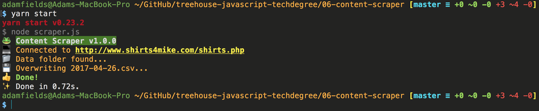

# Build a Content Scraper

### Requirements

#### Command Line Interface and Dependency Management
:white_check_mark: Project includes a `package.json` file containing dependencies to run `node scraper.js`.  
:white_check_mark: Running `npm install` installs relevant dependencies.  
:white_check_mark: The `scraper.js` file can be run with the `npm start` command.

#### Folder Generation
:white_check_mark: Program creates one `data` folder, if that folder doesn’t already exist. If the folder does exist, the program does nothing.

#### Research npm packages
:white_check_mark: Chosen scraping and CSV packages have at least 1,000 downloads and have been updated in the last 6 months on NPM.

#### Crawling
:white_check_mark: The project uses the [http://shirts4mike.com/shirts.php](http://shirts4mike.com/shirts.php) URL as an entry point to look through the links on the page to find 8 shirts.

#### Scraping and Saving Data
:white_check_mark: Project scrapes the product title, price, image and url, and all information is correct and in the correct place.  
:white_check_mark: A CSV is successfully saved to the `data` folder in this format: `YYYY-MM-DD.csv`, e.g. `2016-12-30.csv`.  
:white_check_mark: Column headers are in this order: Title, Price, ImageURL, URL, Time.

#### Overwriting Data
:white_check_mark: If the script is run twice, the program overwrites the data. The file contains the data from the second call.

#### Error Handling
:white_check_mark: The program displays a human-friendly error (not just the original error code) when it cannot connect to [http://shirts4mike.com](http://shirts4mike.com).  
:white_check_mark: Program logs errors in a `scraper-error.log` file.  
:white_check_mark: New errors append to the end of the file with a timestamp, e.g. `[Tue Feb 16 2016 13:00:55 GMT-0800 (PST)] <error message>`.

### Instructions

1. Download and extract `content-scraper.zip`.
2. Run `npm install` or `yarn install` within the project folder to install all dependencies.
3. Run `npm start` or `yarn start` within the project folder to run the program.

### Notes
This application was built on Node 7.9.0 and uses ES2015 features like arrow functions, string template literals, object literal shorthand properties, and promises. If you're running Node 6.10.2 (the current LTS version), you should be fine.  

The scraping package is `cheerio`, which has over 3 million downloads this month. For parsing JSON to CSV, I'm using the approptiately named `json2csv` package, which has over 100,000 downloads this month.  

The output text is colored and has emoji (see screenshot above). If you have a bright green or yellow background for your terminal, the text may not appear legible. Also, if you're using a bright green or yellow background in your terminal, you should apologize to your retinas.  

Enjoy!
